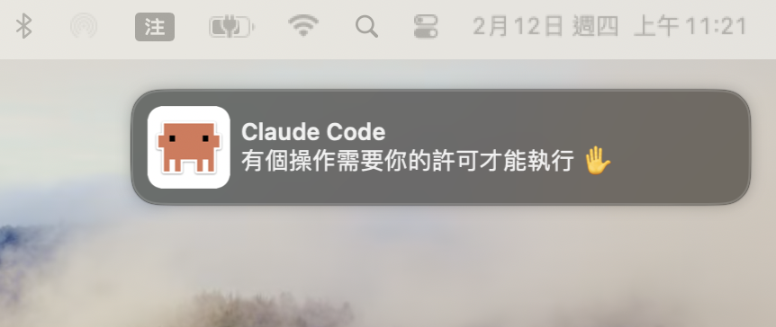

# Claude Code macOS Notifier

A native macOS notification system for [Claude Code](https://claude.ai/code) hooks, featuring a custom clawd icon.



## Why This Exists

Claude Code's `Notification` hook fires when Claude needs your attention and the terminal is **not in focus**. The challenge is delivering macOS notifications with a custom icon:

| Approach | Custom Icon | Problem |
|----------|:-----------:|---------|
| **osascript** (`display notification`) | No | Always shows Script Editor's icon — macOS ties notification icons to the **sending process identity** |
| **terminal-notifier** (`-appIcon`) | No | Relies on a private Apple API, broken since macOS Big Sur (11.0) ([issue #287](https://github.com/julienXX/terminal-notifier/issues/287)) |
| **Native Swift .app** (this project) | **Yes** | macOS uses the .app's own icon — full control |

## File Structure

```
~/.claude/hooks/claude-code-notifier/
├── Claude Code.app/             # macOS application bundle
│   └── Contents/
│       ├── Info.plist           # Bundle config (LSUIElement: true hides from Dock)
│       ├── MacOS/
│       │   └── Claude Code      # Compiled Swift binary
│       └── Resources/
│           └── AppIcon.icns     # clawd icon (85% on white rounded rect)
├── notify.sh                    # Hook entry point (focus check → parse JSON → notify)
├── notify.conf                  # User config (overrides English defaults in notify.sh)
├── notifier.swift               # Notification sender source (NSUserNotification)
├── generate_icon.swift          # Icon generator (CoreGraphics compositing)
├── assets/                      # Source images for icon generation
│   └── clawd-normal.png         # clawd source image
├── README.md                    # English documentation
└── README_ZH.md                 # 繁體中文文件
```

### File Purposes

| File | Purpose |
|------|---------|
| `notify.sh` | Hook entry point. Checks terminal focus (iTerm2 tab-aware), loads notify.conf, parses stdin JSON, calls the .app binary |
| `notify.conf` | User configuration. Overrides English defaults (sound and messages) in `notify.sh`. See [Custom messages](#custom-messages) for format |
| `notifier.swift` | Swift source for the notification binary. Uses `NSApplication` + `NSUserNotificationCenterDelegate` to deliver notifications and handle click-to-activate (switches to the terminal when the user clicks a notification banner) |
| `generate_icon.swift` | Generates the app icon. Loads a source image, composites it at 85% scale onto a 1024x1024 white rounded rectangle canvas (cornerRadius: 180), outputs PNG |
| `Claude Code.app` | Compiled .app bundle. `LSUIElement: true` keeps it hidden from Dock. Bundle ID: `com.claude-code.notifier` |

## Prerequisites

- macOS 10.10+ (tested on macOS 14 Sonoma)
- Xcode Command Line Tools (`xcode-select --install`)
- A source icon image (e.g., `~/.claude/hooks/claude-code-notifier/assets/clawd-normal.png`)
- Python 3 (pre-installed on macOS, used by `notify.sh` for JSON parsing)

## Build from Source

### Step 1: Create the .app bundle structure

```bash
APP_DIR="$HOME/.claude/hooks/claude-code-notifier/Claude Code.app"
mkdir -p "$APP_DIR/Contents/MacOS"
mkdir -p "$APP_DIR/Contents/Resources"
```

### Step 2: Create Info.plist

```bash
cat > "$APP_DIR/Contents/Info.plist" << 'EOF'
<?xml version="1.0" encoding="UTF-8"?>
<!DOCTYPE plist PUBLIC "-//Apple//DTD PLIST 1.0//EN" "http://www.apple.com/DTDs/PropertyList-1.0.dtd">
<plist version="1.0">
<dict>
	<key>CFBundleIdentifier</key>
	<string>com.claude-code.notifier</string>
	<key>CFBundleName</key>
	<string>Claude Code</string>
	<key>CFBundleDisplayName</key>
	<string>Claude Code</string>
	<key>CFBundleExecutable</key>
	<string>Claude Code</string>
	<key>CFBundleIconFile</key>
	<string>AppIcon</string>
	<key>CFBundlePackageType</key>
	<string>APPL</string>
	<key>CFBundleVersion</key>
	<string>1.0</string>
	<key>CFBundleShortVersionString</key>
	<string>1.0</string>
	<key>LSMinimumSystemVersion</key>
	<string>10.10</string>
	<key>LSUIElement</key>
	<true/>
</dict>
</plist>
EOF
```

> `LSUIElement: true` prevents the app from appearing in the Dock when running.

### Step 3: Compile the notification binary

```bash
swiftc notifier.swift \
  -o "$APP_DIR/Contents/MacOS/Claude Code" \
  -framework Cocoa
```

### Step 4: Generate the icon

Compile and run `generate_icon.swift`:

```bash
swiftc generate_icon.swift -o /tmp/generate_icon -framework Cocoa

# Usage: generate_icon [output_path] [source_image_path]
/tmp/generate_icon /tmp/clawd-1024.png ~/.claude/hooks/claude-code-notifier/assets/clawd-normal.png
# If no arguments: outputs ./clawd-1024.png using ~/.claude/hooks/claude-code-notifier/assets/clawd-normal.png
```

This outputs a 1024x1024 PNG. Convert it to `.icns`:

```bash
PNG_PATH="/tmp/clawd-1024.png"
ICONSET_DIR="/tmp/icon.iconset"
mkdir -p "$ICONSET_DIR"

for size in 16 32 128 256 512; do
  sips -z $size $size "$PNG_PATH" --out "$ICONSET_DIR/icon_${size}x${size}.png" >/dev/null
  double=$((size * 2))
  sips -z $double $double "$PNG_PATH" --out "$ICONSET_DIR/icon_${size}x${size}@2x.png" >/dev/null
done

iconutil -c icns "$ICONSET_DIR" -o "$APP_DIR/Contents/Resources/AppIcon.icns"
rm -rf "$ICONSET_DIR" /tmp/generate_icon "$PNG_PATH"
```

### Step 5: Make notify.sh executable

```bash
chmod +x notify.sh
```

## Register with macOS

The .app must be registered with macOS before notifications will appear.

### First-time registration

```bash
open "$HOME/.claude/hooks/claude-code-notifier/Claude Code.app"
```

Then go to **System Settings → Notifications → Claude Code** and enable notifications.


### Re-registration (after moving the .app or icon changes)

```bash
# Unregister old entry
/System/Library/Frameworks/CoreServices.framework/Frameworks/LaunchServices.framework/Support/lsregister \
  -u "$HOME/.claude/hooks/claude-code-notifier/Claude Code.app"

# Re-register
/System/Library/Frameworks/CoreServices.framework/Frameworks/LaunchServices.framework/Support/lsregister \
  "$HOME/.claude/hooks/claude-code-notifier/Claude Code.app"

# Refresh icon cache
killall Dock

# Re-open to activate
open "$HOME/.claude/hooks/claude-code-notifier/Claude Code.app"
```

### Remove from Launchpad (if it appears)

```bash
defaults write com.apple.dock ResetLaunchPad -bool true && killall Dock
```

> This resets Launchpad layout for all apps. The .app is in a hidden directory (`~/.claude/`) so it should not reappear.

## Claude Code Hook Integration

Add to `~/.claude/settings.json`:

```json
{
  "hooks": {
    "Notification": [
      {
        "matcher": "",
        "hooks": [
          {
            "type": "command",
            "command": "$HOME/.claude/hooks/claude-code-notifier/notify.sh"
          }
        ]
      }
    ],
    "Stop": [
      {
        "matcher": "",
        "hooks": [
          {
            "type": "command",
            "command": "$HOME/.claude/hooks/claude-code-notifier/notify.sh"
          }
        ]
      }
    ]
  }
}
```

### Supported events

| Event | When it fires | Built-in focus check |
|-------|--------------|:--------------------:|
| `Notification` | Claude needs attention (permission, idle, etc.) | Yes (only fires when terminal is not in focus) |
| `Stop` | Claude finishes responding | No (fires every time) |

Both events share the same `notify.sh` script. The script includes its own **terminal focus detection** so that `Stop` events are also suppressed when you're actively using the terminal.

### How it works

1. Claude Code fires a `Notification` or `Stop` event
2. The hook sends stdin JSON to `notify.sh`
3. `notify.sh` checks if a terminal app is in focus (see Terminal focus detection below)
4. Loads user notify.conf file if present
5. Parses the JSON to extract `hook_event_name`, `notification_type`, and optional `message`
6. Determines the notification message by priority:
   - `hook_event_name` is `Stop` → configured stop message (default: "Task completed")
   - `notification_type` maps to a configured message (from `notify.conf`, or English defaults):

| notification_type | Default Message |
|------|----------------|
| `permission_prompt` | Waiting for your approval |
| `idle_prompt` | Waiting for your response |
| `auth_success` | Authentication successful |
| `elicitation_dialog` | Waiting for your selection |
| *(other)* | `message` from stdin JSON if present, otherwise "Needs your attention" |

7. The .app binary sends the macOS notification with the clawd icon and configured sound
8. When the user clicks the notification banner, the app activates the terminal (iTerm2 → Terminal.app → WezTerm → Alacritty → kitty, first found)

### Terminal focus detection

The script uses **smart tab detection** for iTerm2, and simple app-level detection for other terminals:

```
Frontmost app is iTerm2?
├─ No  → Send notification
└─ Yes → Walk up claude's process ancestry to check if any ancestor
         is on the visible tab's tty
    ├─ Ancestor found on visible tty → Suppress (you're looking at Claude)
    └─ No ancestor match → Send notification (you're on a different tab)

Frontmost app is other terminal (Terminal / WezTerm / Alacritty / kitty / tmux)?
└─ Suppress (no tab detection, always skip)
```

The iTerm2 tab detection works by:
1. Using AppleScript to get the currently visible session's tty (`/dev/ttysXXX`)
2. Finding the `claude` process PID via `ps`
3. Walking up the parent process chain (PPID → PPID → ...) and checking each ancestor's tty
4. If any ancestor's tty matches the visible tty → suppress (the user is on the Claude tab)

> **Why walk the process tree?** `claude` allocates its own pseudo-terminal (e.g., `/dev/ttys011`), which differs from the iTerm2 session's tty (e.g., `/dev/ttys008`). However, claude's grandparent shell runs on the session's tty, so walking up the tree finds the match.

To add tab detection for other terminals, extend the `case` block in `notify.sh`.

### Custom messages

Default messages are in English (hardcoded in `notify.sh`). To customize, create a `notify.conf` file in the notifier directory:

```bash
~/.claude/hooks/claude-code-notifier/notify.conf
```

Example — Traditional Chinese (繁體中文):

```bash
# Notification sound
# Available: Basso, Blow, Bottle, Frog, Funk, Glass, Hero, Morse, Ping, Pop, Purr, Sosumi, Submarine, Tink
NOTIFY_SOUND=Glass

# Custom messages
L_PERMISSION="有個操作需要你的許可才能執行 ✋"
L_IDLE="目前等待中，需要你的回覆 💬"
L_AUTH="認證已通過，流程繼續 🛂"
L_ELICITATION="出現了選項，需要你來做決定 🤔"
L_STOP="任務完成，請過目 ✅"
L_DEFAULT="有個環節需要你確認一下 👀"
```

You can override any subset — unset values fall back to the English defaults.

> **Important**: The `notify.conf` file must use Unix line endings (LF). If it uses CRLF (`\r\n`), the trailing `\r` will stick to variable values, causing messages to display incorrectly or fall back to English defaults. Fix with: `perl -pi -e 's/\r\n/\n/g' notify.conf`

### Test manually

```bash
# Simulate a permission_prompt event
echo '{"notification_type":"permission_prompt"}' | ~/.claude/hooks/claude-code-notifier/notify.sh

# Simulate an unknown type (falls back to message field)
echo '{"notification_type":"some_new_type","message":"Custom message here"}' | ~/.claude/hooks/claude-code-notifier/notify.sh

# Call the binary directly
~/.claude/hooks/claude-code-notifier/"Claude Code.app"/Contents/MacOS/"Claude Code" "Title" "Message" "Glass"

# Test click-to-activate (switch to another app within 3 seconds, then click the notification)
(sleep 3 && ~/.claude/hooks/claude-code-notifier/"Claude Code.app"/Contents/MacOS/"Claude Code" "Claude Code" "Click me" "Glass") &
```

## Customization

### Change icon size

Edit `clawdScale` in `generate_icon.swift` (0.0 ~ 1.0, default: 0.85), then rebuild the icon (Step 4).

### Change notification sound or messages

Create or edit the `notify.conf` file and set `NOTIFY_SOUND` or individual `L_*` messages. See the [Custom messages](#custom-messages) section for details.

### Notification display style

Go to **System Settings → Notifications → Claude Code** to choose:

| Style | Behavior |
|-------|----------|
| **Banners** | Auto-dismiss after a few seconds |
| **Alerts** | Stay until manually dismissed |

## Troubleshooting

| Issue | Solution |
|-------|----------|
| No notification appears | Run `open "$HOME/.claude/hooks/claude-code-notifier/Claude Code.app"` to register, then enable in System Settings → Notifications |
| Icon missing after move | Re-register: `lsregister -u` then `lsregister` then `killall Dock` then `open` (see Re-registration above) |
| App appears in Launchpad | Run `defaults write com.apple.dock ResetLaunchPad -bool true && killall Dock` |
| `NSUserNotification` deprecation warning | Expected on macOS 11+. Still functional on macOS 14 Sonoma. Future versions may need migration to `UNUserNotificationCenter` |
| `notify.sh: bad interpreter` | Fix line endings: `perl -pi -e 's/\r\n/\n/g' notify.sh` |
| `notify.conf` messages ignored (still English) | The `notify.conf` file likely has CRLF (`\r\n`) line endings. Fix with: `perl -pi -e 's/\r\n/\n/g' notify.conf` |

## Uninstall

### Remove the .app from notifications

```python
python3 -c "
import plistlib
path = '$HOME/Library/Preferences/com.apple.ncprefs.plist'
with open(path, 'rb') as f:
    data = plistlib.load(f)
data['apps'] = [a for a in data.get('apps', []) if a.get('bundle-id') != 'com.claude-code.notifier']
with open(path, 'wb') as f:
    plistlib.dump(data, f)
print('Removed from notification settings')
"
killall NotificationCenter 2>/dev/null
killall usernoted 2>/dev/null
```

### Unregister from Launch Services

```bash
/System/Library/Frameworks/CoreServices.framework/Frameworks/LaunchServices.framework/Support/lsregister \
  -u "$HOME/.claude/hooks/claude-code-notifier/Claude Code.app"
```

### Delete all files

```bash
rm -rf "$HOME/.claude/hooks/claude-code-notifier"
```

### Remove hook from settings.json

Remove the `Notification` and `Stop` entries from `~/.claude/settings.json`.

## Notes

- `NSUserNotification` is deprecated since macOS 11 but still works on macOS 14 Sonoma
- The `Notification` hook only fires when the terminal is **not in focus** — you won't see notifications while actively using Claude Code
- Clicking a notification banner automatically switches to the terminal running Claude Code. This works whether the app is still running (delegate callback) or has already exited (macOS relaunches the app to handle the click)
